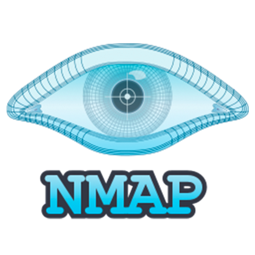
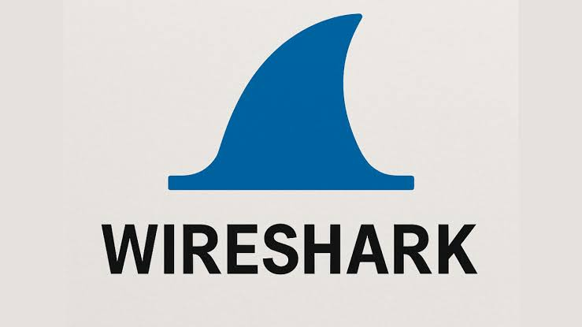
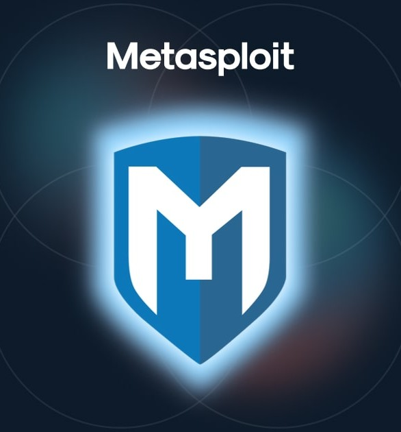

<h1 align="center">Hi 👋, I'm Saptak Paul</h1>
<h3 align="center">🚀 Cybersecurity Enthusiast | CSE Student | Linux & Networking Learner | Aspiring Security Engineer</h3>

  

---

## 👨‍💻 About Me

- 🎓 CSE Student from **India**
- 🔐 Learning **Cybersecurity** through practical labs
- 🌱 Currently learning **Linux, Networking, Wireshark, Nmap & Git**
- 🤖 Exploring **AI + Cybersecurity**
- 💻 Building projects to strengthen my portfolio
- 🎯 Goal: Become a **Cybersecurity Engineer**

---

## 🚀 Current Focus

- 🌐 Networking Fundamentals
- 🐧 Linux Administration
- 🔍 Wireshark Packet Analysis
- 📡 Nmap Scanning
- 🛡️ Blue Team Skills
- ☁️ Cloud Security (Upcoming)

---

## 🛠 Languages & Tools

---
## 🔐 Security Tools

---

## 🌐 Connect with Me

---

## 📊 GitHub Statistics

---

## 📈 Contribution Graph

---

### 💡 Quote

> *"The best way to learn cybersecurity is to break, analyze, understand, and build."* 🔐
